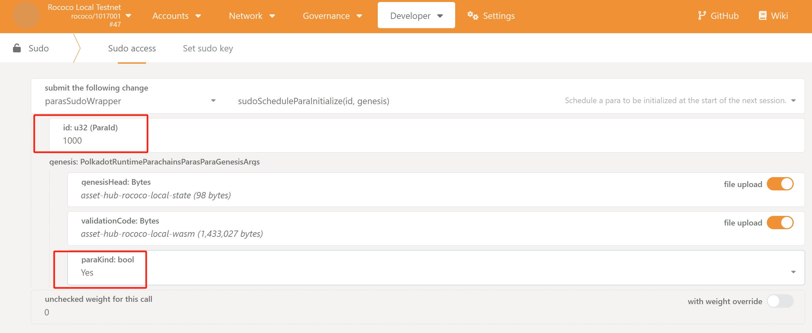
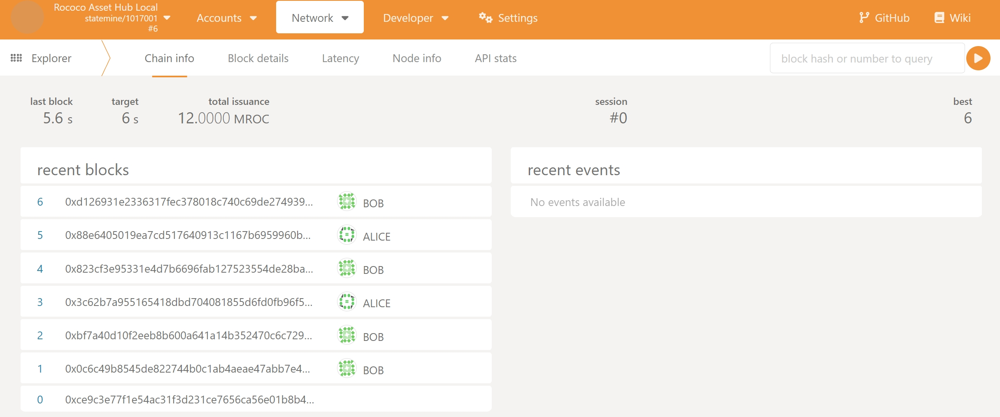

# Local Parachain Setup Guide

This guide explains how to set up and run a local parachain environment with a relay chain and Asset Hub parachain.

## Prerequisites

- Docker installed
- Bash shell environment

## Setup Steps

### 1. Environment Configuration

Create a `.env` file in the root directory with the following variables:

```bash
VERSION=v1.3.0 # Polkadot version
GENESIS_OUTPUT_DIR=./genesis # Directory for genesis files
DATA_DIR=./data # Directory for chain data
RELAY_CHAIN_SEPC=<relaychain_spec_name> # Relay chain spec name
ASSET_HUB_CHAIN_SEPC=<asset_hub_spec_name> # Asset Hub chain spec name
```

### 2. Run scripts to prepare the local networks

Run the preparation script:

```bash
./scripts/prepare.sh
```

If successful, you will see the following output:

```
*****************************Step1: Pulling docker images*****************************
Pulling: parity/polkadot:v1.17.0
v1.17.0: Pulling from parity/polkadot
Digest: sha256:2c7f844f5d8668eedc1455620c6b3fdbccdd92d33fe3e50fd6d7d9ea00b6a682
Status: Image is up to date for parity/polkadot:v1.17.0
docker.io/parity/polkadot:v1.17.0
Pulling: parity/polkadot-parachain:v1.17.0
v1.17.0: Pulling from parity/polkadot-parachain
Digest: sha256:86b55be9f2a67b16de41fa613238bd62eb59a384993e592807abe3b384180cba
Status: Image is up to date for parity/polkadot-parachain:v1.17.0
docker.io/parity/polkadot-parachain:v1.17.0
*****************************Step2: Generating bootnodes*****************************
Generating relaychain bootnode...
relaychain_bootnode: /ip4/127.0.0.1/tcp/30333/p2p/12D3KooWHShyBLHhSm9cVqdYDpQfcDo7zCwa1e2BQw5eN5WfcaHQ
Generating asset-hub bootnode...
asset_hub_bootnode: /ip4/127.0.0.1/tcp/30333/p2p/12D3KooWMtSRKUHH1SP3254t4Ub5yegBFSYeaM4EVNvko7j9ke4g
*****************************Step3: Generating genesis*****************************
Generating relaychain genesis...
2025-01-19 16:41:09 Building chain spec
Generating asset-hub-parachain genesis...
2025-01-19 16:41:12 Building chain spec
*****************************Step3.1: Update parachain bootnode to new port*****************************
update asset hub chain spec bootnode port to a new one...
Now it's:
{
  "name": "Rococo Asset Hub Local",
  "id": "asset-hub-rococo-local",
  "chainType": "Local",
  "bootNodes": [
    "/ip4/127.0.0.1/tcp/31333/p2p/12D3KooWMtSRKUHH1SP3254t4Ub5yegBFSYeaM4EVNvko7j9ke4g"
  ],
*****************************Step4: Exporting genesis state & wasm*****************************
Exporting genesis state for asset-hub-parachain...
2025-01-19 16:41:16 assembling new collators for new session 0 at #0
2025-01-19 16:41:16 assembling new collators for new session 1 at #0
2025-01-19 16:41:17 🔨 Initializing Genesis block/state (state: 0x4eb9…91a4, header-hash: 0xce9c…ce34)
2025-01-19 16:41:17  creating SingleState txpool Limit { count: 8192, total_bytes: 20971520 }/Limit { count: 512, total_bytes: 1048576 }.
Exporting genesis state for asset-hub-parachain...
2025-01-19 16:41:20 assembling new collators for new session 0 at #0
2025-01-19 16:41:20 assembling new collators for new session 1 at #0
```

This script will:

- Pull required Docker images
- Generate bootnode keys and IDs
- Create chain specifications
- Export genesis state and WASM for the parachain

### 3. Running the Local Networks
Run local networks with the following command:
```bash
docker compose up -d
````

If successful, you will see the following output:

```
WARN[0000] The "UID" variable is not set. Defaulting to a blank string.
WARN[0000] The "GID" variable is not set. Defaulting to a blank string.
WARN[0000] The "UID" variable is not set. Defaulting to a blank string.
WARN[0000] The "GID" variable is not set. Defaulting to a blank string.
WARN[0000] The "UID" variable is not set. Defaulting to a blank string.
WARN[0000] The "GID" variable is not set. Defaulting to a blank string.
WARN[0000] The "UID" variable is not set. Defaulting to a blank string.
WARN[0000] The "GID" variable is not set. Defaulting to a blank string.
WARN[0000] /home/king/workspace/blockchain/open-web3-stack/assethub-launch/docker-compose.yml: the attribute `version` is obsolete, it will be ignored, please remove it to avoid potential confusion
[+] Running 5/5
 ✔ Network assethub-launch_default  Created                                                                                                                                 0.1s
 ✔ Container relay-alice            Started                                                                                                                                 1.4s
 ✔ Container asset-hub-bob          Started                                                                                                                                 2.1s
 ✔ Container relay-bob              Started                                                                                                                                 2.0s
 ✔ Container asset-hub-alice        Started
```

### 4. Registering the Parachain on the Relaychain

At this point, the Relaychain and Parachain have only established communication at the network level, but the Parachain cannot actually produce blocks. This is because, at the "chain" level, the Parachain has not yet been connected to the Relaychain.

Open https://polkadot.js.org/apps/, and enter the endpoints for the Relaychain and Parachain:

```
relaychain: 127.0.0.1:9944
parachain: 127.0.0.1:19944
```

Open the asset-hub page, and you will see that the parachain is not producing blocks at this moment:


At this point, switch to the Relaychain's Polkadot.js page. Navigate to the Developer -> Sudo page and execute the paraSudoWrapper::sudoScheduleParaInitialized method to onboard the asset-hub parachain.
Note that the parachain ID for the asset-hub is 1000. Then, select the state and wasm files under genesis, upload them, and execute the transaction:


Go back to the Network section, and you will see that the command was successfully executed using sudo. After waiting for two sessions (one session is typically 10 blocks in a test environment), switch to the asset-hub Polkadot.js page:


At this point, the parachain is finally producing blocks!

## Additional Resources

- [Polkadot Documentation](https://wiki.polkadot.network)
- [Substrate Documentation](https://docs.substrate.io)
